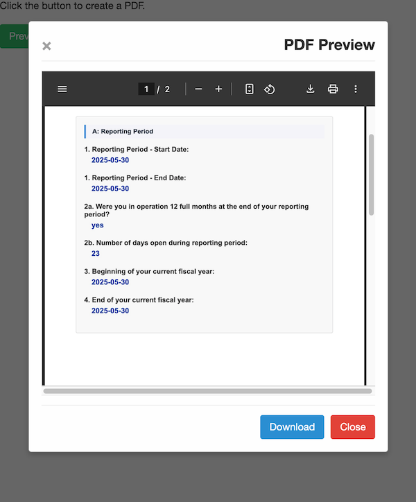

# Print PDF



## Description

This field plug-in allows users to generate and download PDF documents from SurveyCTO form content. The plug-in provides a user-friendly interface with options to preview the PDF before downloading, making it perfect for creating printable reports, certificates, or form submissions directly from your SurveyCTO forms.

[](https://github.com/surveycto/print-pdf/raw/main/print-pdf.fieldplugin.zip)

### Features

1. Generate PDF documents from form content
2. Preview PDF before downloading
3. Customize page margins
4. Set custom filename for the downloaded PDF
5. Choose paper size (A4, letter, etc.)
6. Select orientation (portrait or landscape)

## How to use

### Getting started

**To use this plug-in as-is**

1. Download the [sample form](https://github.com/surveycto/print-pdf/raw/main/extras/sample-form/Sample%20form%20-%20Print%20PDF%20field%20plug-in.xlsx) from this repo and upload it to your SurveyCTO server.
2. Download the [print-pdf.fieldplugin.zip](https://github.com/surveycto/print-pdf/raw/main/print-pdf.fieldplugin.zip) file from this repo, and attach it to the sample form on your SurveyCTO server.

### Parameters

| Parameter key | Parameter value |
| ------------- | --------------- |
| `content` | The HTML content to be converted to PDF. This can include form field references with dynamic values. |
| `marginslr` (Optional)| Left and right margins in millimeters. Default is 10mm if not specified. |
| `marginstb` (Optional)| Top and bottom margins in millimeters. Default is 15mm if not specified. |
| `filename` (Optional)| The name of the downloaded PDF file. Default is "document.pdf" if not specified. |
| `paperSize` (Optional)| The paper size for the PDF. Options include: "a4", "letter", "legal", etc. Default is "a4" if not specified. |
| `orientation` (Optional)| The orientation of the PDF. Options are "portrait" or "landscape". Default is "portrait" if not specified. |

### Example

To create a PDF with custom margins, filename, and paper size, the following would be placed in the appearance column of the spreadsheet form definition:

```
custom-print-pdf(content=${report_content}, marginslr=15, marginstb=20, filename='Patient_Report.pdf', paperSize='letter', orientation='portrait')
```

Where `${report_content}` is a field reference containing the HTML content to be converted to PDF.

### HTML Content Formatting Tips

For best results when formatting your HTML content for PDF conversion:

1. Use section elements (`<section>`) to organize content into logical groups
2. Use headings (`<h1>`, `<h2>`, etc.) to structure your document
3. Avoid fixed-width containers that might exceed page width
4. Use inline CSS for styling rather than external stylesheets
5. Keep image sizes reasonable to ensure they fit within page dimensions
6. **Control page breaks** using CSS properties:
   - Force a new page: `<section style="page-break-before: always; break-before: page;">`
   - Prevent page breaks within content: `<div style="page-break-inside: avoid; break-inside: avoid;">`
   - Avoid page breaks after headings: `<h4 style="page-break-after: avoid; break-after: avoid;">`

#### Page Break Examples

```html
<!-- Start this section on a new page -->
<section style="page-break-before: always; break-before: page;">
    <h4>Training Modules Completed</h4>
    <!-- Section content -->
</section>

<!-- Keep this content together on the same page -->
<div style="page-break-inside: avoid; break-inside: avoid;">
    <h4>Important Information</h4>
    <p>This content will not be split across pages</p>
</div>
```

**Note**: The plugin uses both modern (`break-before`, `break-inside`) and legacy (`page-break-before`, `page-break-inside`) CSS properties for maximum browser compatibility.

### Default SurveyCTO feature support

| Feature / Property | Support |
| ------------------ | ------- |
| Supported field type(s) | `text` |
| Default values | Yes |
| Constraint message | Uses default behavior |
| Required message | Uses default behavior |
| media:image | Yes |
| media:audio | Yes |
| media:video | Yes |
| `show-formatted` appearance | No |

## More resources

* **Sample form**  
  [Download sample form](https://github.com/surveycto/print-pdf/raw/master/extras/sample-form/Sample%20form%20-%20Print%20PDF%20field%20plug-in.xlsx)

* **Developer documentation**  
  Instructions and resources for developing your own field plug-ins.  
  [https://github.com/surveycto/Field-plug-in-resources](https://github.com/surveycto/Field-plug-in-resources)

* **User documentation**  
  How to get started using field plug-ins in your SurveyCTO form.  
  [https://docs.surveycto.com/02-designing-forms/03-advanced-topics/06.using-field-plug-ins.html](https://docs.surveycto.com/02-designing-forms/03-advanced-topics/06.using-field-plug-ins.html)